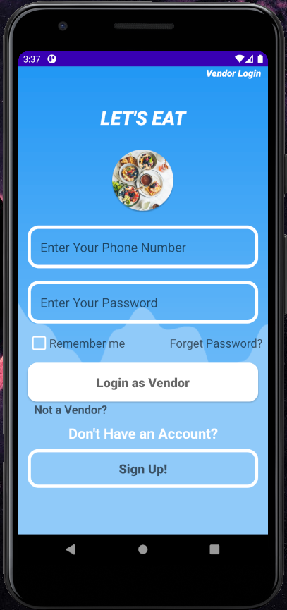

  

                                        

  <h1 align="center">Project Name: LET'S EAT</h1>
  <h2 align ="center">Course Number: CSE 486 
  Section:1 
  Semester: Fall 2020  
  Faculty Name: Shaikh Shawon Arefin Shimon</h2>
  <h3 align="center">Student Name: Emamul Hassan 
  Student ID: 1731250642 
  Email: emamul.hassan@northsouth.edu   
  Date prepared: 20/01/2021</h3>   

<h2> Project Name: LET'S EAT </h2> 
<h3 id="table-of-contents">Table of Contents</h3>

<ol>
  <a href="#introduction"><li>Introduction</li> </a>
  <a href="#features"><li>Features</li> </a>
  <a href="#dataManagement"><li>Data Management</li> </a>
  <a href="#designPattern"><li>Design Pattern</li></a> 
  <a href="#roadblocks"><li>Roadblocks</li></a> 

</ol>
 

<h2 id="introduction">1. Introduction</h2>

In a small country like Bangladesh, the number of people ordering online for various products in surprisingly high. A recent global Food Ordering and Delivery survey by "Statista" states that, about 47% of the food ordering market is offline, while 53% is online. In Bangladesh the numbers would be pretty high. As we can see that the food delivery market in Dhaka has grown hyper-competitive over the past two years. Many online food delivery services like Pathao, FoodPanda, ShohozFood etc. are growing rapidly. While their services are impressive, but for a county like ours foods are expensive too. These food delivery are only from resturants. But still it creates some issues for office workers. For health concerns, people prefers lunch and breakfast meals from home rather than restaurants.What if we can do something about this? What if we can create a food ordering service which will be based on home cooked meals? 
 
 

In this project I will be developing a food delivery app which will serve people with home cooked meals. This app will help people to choose and select food from various vendors, order the food and get them by their door step or workplace. This app will have both vendor and customer service features with different UI. Its basically a 2 in 1 application.

 

<h2 id="features">2. Features</h2>
This project has the following features -

<h3>2.1 Customer Registration:</h3>
  To access the application, a customer must have to register first. A customer can register with a phone number which will be used as their primary login service. This app will also ask for a Username which will be stored in the database. Customer must also input a Primary Address as it will be used to deliver the food.
   
   
 

    
   Figure 1.0
 

 <h3>2.2 Customer Login:</h3>
  Customers who have registered, can use their phone number and password to login to access the app and order foods. 
   
  

   
  Figure 2.0
 

  

 
 <h3>2.3 Vendor Login:</h3>
  Vendors can also use their phone number and password to login to access the app and add or process foods for customer. 
  

    
   Figure 3.0
 

   

 
<h3>2.4 Customer Feature:</h3>
  
Currently the following functions are available for Customers-
  

    * After a successful login customer will land on the HomePage of the App. 
    * A Menu Drawer is available for customer to browse different options. 
    * Customer can search their desired food item from the app. 
    * Settings menu to update User name, Phone number and Address. 
    * Check details of each food available. 
    * Add to cart option and Cart menu to see ordered items and total price. 
    * Final customer details input section for delivery location. 
    * A cooldown for customer to order again until first order is verified by vendor to avoid spamming. 
    

	  	 
	  	Figure 4.0
	
 

	  	 
	  	Figure 5.0
	
 

 
<h3>2.5 Vendor Feature:</h3>
  
Currently the following functions are available for Vendors-
  

    * After a successful login vendor will land on the a unique HomePage for vendors. 
    * There are 4 food categories available for vendor to add food to them. 
    * A check new order button to check for food orders from customer. 
    * Edit food item details option to update food price or description. 
    * Option to delete or remove an item from the shop. 
    * Pop up option on orders to let the user know that the food is processing or not. 
    * Order details option to check the customer details(name, phone number, address etc.) 
 	

	  	 
	  	Figure 6.0
	
 

	  	 
	  	Figure 7.0
	
 

 

   
<h3>2.6 Admin Panel:</h3>
There's also a Admin panel in Firebase Database, from which the Admin can delete spam accounts, control and manage both users and items. They can also assign new admins or sub admins with filtered permission and monitor activities.

 
Figure 8.0

  

 <h2 id="dataManagement">3. Data Management</h2>
 <h3>Firebase Database: </h3>
 
For Data management I have chosen Google's Firebase Database.The Firebase Realtime Database is a cloud-hosted NoSQL database that lets you store and sync data between your users in realtime. SQLite is local database on Android device (data stored/processed on a device) with SQL interface, which makes FireBase suitable for real time applications. Cloud Firestore enables you to store, sync and query app data at global scale. The reason for using firebase is that its free, user friendly and has multiple features, such as:

<ul>
    <li> Realtime: Instead of typical HTTP requests, the Firebase Realtime Database uses data synchronization—every time data changes, any connected device receives that update within milliseconds. Provide collaborative and immersive experiences without thinking about networking code.</li>
    <li>Offline: Firebase apps remain responsive even when offline because the Firebase Realtime Database SDK persists your data to disk. Once connectivity is reestablished, the client device receives any changes it missed, synchronizing it with the current server state.</li>
    <li>Accessible from Client Devices	: The Firebase Realtime Database can be accessed directly from a mobile device or web browser; there’s no need for an application server. Security and data validation are available through the Firebase Realtime Database Security Rules, expression-based rules that are executed when data is read or written.</li>
    <li>Scale across multiple databases	: With Firebase Realtime Database on the Blaze pricing plan, you can support your app's data needs at scale by splitting your data across multiple database instances in the same Firebase project. Streamline authentication with Firebase Authentication on your project and authenticate users across your database instances. Control access to the data in each database with custom Firebase Realtime Database Rules for each database instance.</li>
</ul> 

All informations are taken from– "https://firebase.google.com/docs/database"

  
  

<h2 id="designPattern">4. Design Pattern</h2>

No design pattern was used in database. Firebase Database was installed by Android Studio and I did not make any changes to the process. 
  

<h2 id="roadblocks">5. Roadblocks</h2>

In summary the app is a home made food delivery app which was developed to use by both customer and vendor to have a perfect ecosystem in online food delivery system. In this project we completed most of the functionalities proposed. Except the API part of Google map. Though basic features of the app works fine, there are no auto location features. as Google map requires credit card for map API implementation. Also one more major problem is, I could not added a feature for vendor account creation. A vendor role can only be given by Admin of Firebase. Without this feature the app is incomplete. So, in short, multi vendor was not shown in this app. A customer can not sort by vendor or see their informations. Customer can only order food by its name and price. Also i could not implement review and rating system due to shortage of time. In future, I plan to implement these missing functionalities,come up with better solution for the implementation and make the app even better.

